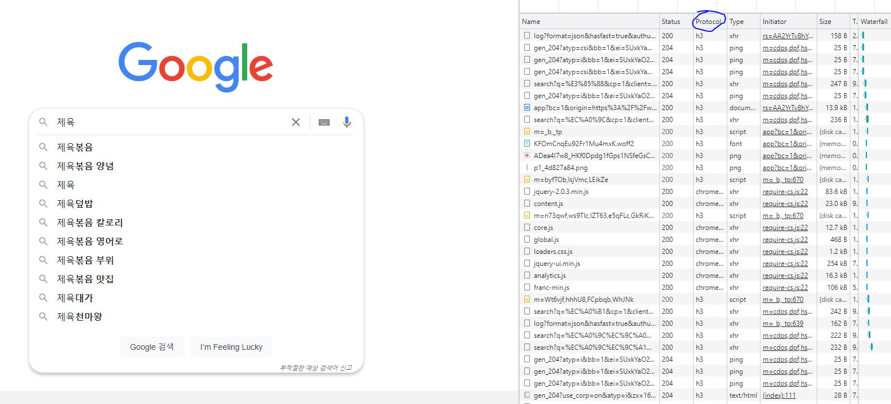
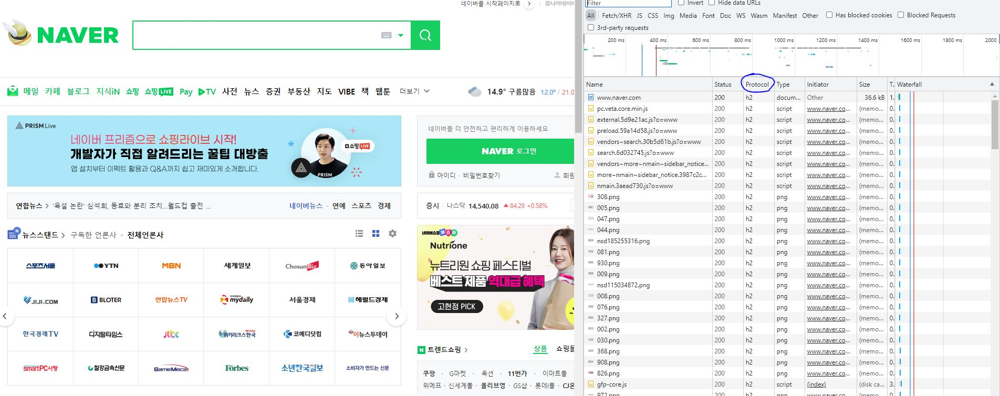

# 모든 것이 HTTP

- HTML, TEXT, JSON, XML, IMAGE, 음성 등등 거의 모든 형태 데이터 전송 가능

- 서버 간에 데이터를 주고 받을때도 대부분 HTTP 사용

 

## HTTP 역사

- HTTP/0.9 : GET 메서드만 지원, HTTP 헤더 X

- HTTP/1.0 : 메서드, HTTP 헤더 추가

- HTTP/1.1 (TCP) : 가장 많이 사용 , 우리에게 가장 중요한 버전

- HTTP/2 (TCP): 성능 개선

- HTTP/3 (UDP / 진행중) : TCP 대신에 UDP 사용, 성능 개선

http3 사용

http2 사용

 
 

# HTTP 특징

1.  클라이언트 서버 구조

        클라이언트는 서버에 요청을 보내고 응답 대기
        서버가 요청에 대한 결과를 만들어서 응답

- 서버에는 비즈니스로직, 데이터만을 집어넣고 클라이언트에는 UI만 담당하게 함으로써
  서로 더 발전할 수 있었다.

2.  무상태 프로토콜 (Stateless)

    ㄱ. Stateful 이란?

    서버가 클라이언트의 상태를 유지하면서 응답함

    ==> 만약 서버가 중간에 바뀐다면 바로 오류가 발생하기 때문에

    서버가 바뀌면 안된다는 단점이 있다.

            A. 클라이언트  => 제육 주세요 => 서버
            B. 클라이언트  <= 몇인분 줄까요? <= 서버 (제육)
            C. 클라이언트  => 2인분 주세요 => 서버 (제육 + 2인분)
                *C. 만약 여기서 서버가 바뀌었다면?
                *D. 클라이언트  <= 뭘 2인분 달라고요? <= 서버
                *A. 클라이언트는 다시 결제 과정을 반복해야된다.

            D. 클라이언트  <= 제육 2인분 보냅니다 <= 서버

     

    ㄴ. Stateless 란?

    반대로 서버가 클라이언트의 상태를 보존하지 않고 응답함

    ==> 서버가 중간에 바뀌어도 상태 유지자체를 안하기 때문에

    무한한 서버 증설이 가능하다

        A. 클라이언트  => 제육 2인분 주세요 => 서버
            *A. 애초에 클라이언트가 필요한 정보를 다 보내기 때문에
            서버가 아무리 바뀐들 지장이 없다.

        B. 클라이언트  <= 제육 2인분 보냅니다 <= 서버

     

    ㄷ. Stateless의 한계

    무상태로 설계 가능한 경우들

    - 로그인이 필요 없는 단순한 서비스 소개 화면

    - 매번 필요한 정보를 클라이언트가 다 보내기 때문에 무겁기도 하다.

    상태 유지로 설계해야 될 경우

    - 로그인한 사용자가 로그인했다는 상태를 서버에 유지

    - 보통 브라우저 쿠키, 서버 세션 등 사용해서 상태 유지

    - 그래도 상태 유지는 최소한만 사용

     

3.  비 연결성 (connectionless)
